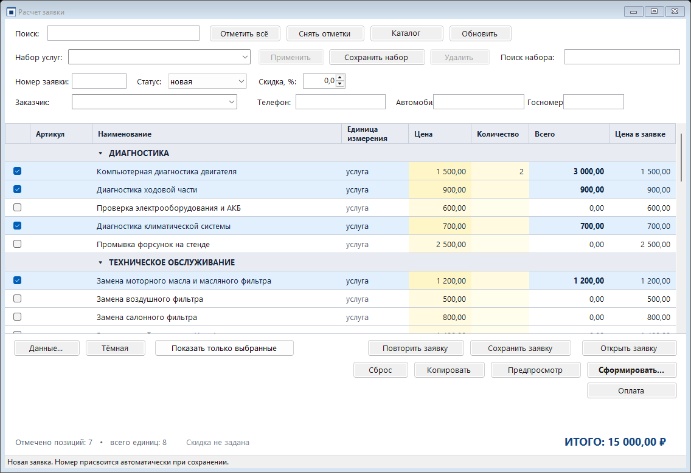
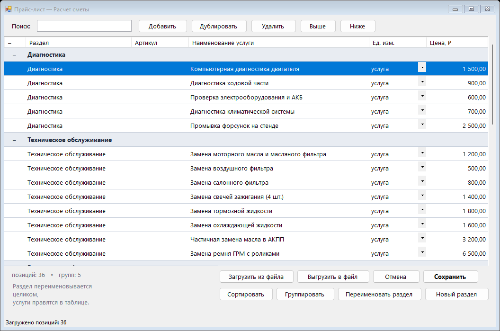

# Расчет заявки

Настольная программа для Windows: считает стоимость услуг по заранее заполненному
справочнику цен. Нужные позиции отмечаются галочками, при необходимости правится
количество — итоговая сумма пересчитывается сразу.



## Две версии программы

| Версия | Файл | Как запускается |
|--------|------|-----------------|
| Настольная (Windows) | `bin\Расчет_заявки.exe` | двойной щелчок по файлу |
| Веб-версия (браузер) | `bin\Заявка.html` | двойной щелчок — открывается в браузере |

Обе версии делают одно и то же: считают заявку по каталог номенклатурыу, позволяют править цены,
позиции и разделы, сохраняют заявку документом Word. У настольной версии данные лежат
в профиле пользователя, у веб-версии — в памяти браузера (`localStorage`).

## Веб-версия (в браузере)

Файл `bin\Заявка.html` — это **одна самодостаточная страница**: стили, скрипт и заводской
каталог номенклатуры встроены внутрь. Ни сервер, ни интернет не нужны — достаточно открыть файл
двойным щелчком (проверено в Яндекс Браузере).

Что умеет:

* отметки галочками и количество — итог пересчитывается сразу;
* поиск по наименованию, артикулу и разделу; разделы сворачиваются щелчком по названию;
* вкладка **Каталог номенклатуры**: правка позиций, разделов, артикулов, цен и единиц измерения
  из перечня (`шт.`, `услуга`, `литр`, `комплект`), добавление и удаление позиций,
  выгрузка и загрузка файла каталог номенклатурыа, возврат заводских цен;
* кнопка **«Сформировать заявку»** — заявка с разделами, итогом и подписями;
  её можно **сохранить в Word** (`.docx` собирается прямо в браузере), распечатать
  или сохранить в PDF средствами браузера, скопировать текстом или скачать `.txt`;
* отметки, количества и правки каталог номенклатурыа сохраняются в браузере и переживают
  перезагрузку страницы;
* скидка, номер заявки и ФИО заказчика, наборы услуг, тёмная тема и правка цены
  прямо в заявке — как в настольной версии.

Пересобрать страницу после правки исходников:

```
powershell -ExecutionPolicy Bypass -File .\build-web.ps1
```

## Показ только выбранных позиций

Кнопка **«Показать только выбранные»** над таблицей оставляет в списке только
отмеченные позиции: удобно проверить заявку перед формированием документа.
Повторное нажатие возвращает весь каталог. Нажатое состояние кнопки видно
по её виду, а в строке состояния пишется, сколько позиций показано.

## Возможности расчёта

* **Скидка на всю заявку** — поле «Скидка, %» в верхней панели; в заявке появляются строки
  «Подытог» и «Скидка», а в «ИТОГО» — сумма к оплате. Скидка сохраняется и попадает в документ.
* **Реквизиты документа** — номер заявки и ФИО заказчика; они печатаются в шапке документа
  и в строке подписи заказчика.
* **Цена позиции правится прямо в заявке** — колонка «Цена в заявке». Цена в каталог номенклатурые
  при этом не меняется, а изменённая цена помечается звёздочкой в документе.
* **Сквозная нумерация позиций** — номера идут по порядку через все разделы, как принято
  в заявках и счетах.
* **Предпросмотр заявки** — кнопка «Предпросмотр» показывает готовый документ до сохранения:
  из окна можно сразу сохранить его в Word или скопировать текстом.
* **Наборы услуг (шаблоны)** — отметьте типовой набор работ и нажмите «Сохранить набор»
  («ТО-1», «Шиномонтаж»). Потом набор отмечается одной кнопкой «Применить».
  Одноимённый набор заменяется, лишний удаляется. Есть поиск по названию набора и по услугам в нём.
* **Тёмная тема** — кнопка «Тёмная» / «Светлая» в нижней панели; выбор запоминается.
* **Выгрузка и загрузка данных** — кнопка «Данные…» сохраняет каталог номенклатуры, наборы услуг
  и реквизиты в один файл `*.smeta`, а также открывает папку с данными.

## Сохранение и открытие заявок

При каждом запуске программа начинает **новую заявку**: отметки позиций, количества,
правки цен, номер и заказчик прошлого раза сбрасываются. Так исключается случайная
работа со старыми отметками.

Заявку можно сохранить в архив и открыть позже для просмотра или повторного
использования.

* **«Сохранить заявку»** — номер присваивается **автоматически и нумеруется в рамках
  года**: 1/2026, 2/2026 и так далее. Дата — дата сохранения. Перед записью
  программа показывает номер, дату, заказчика, число позиций и скидку, чтобы
  можно было проверить. Номер попадает в реквизиты документа и в печатную форму.
* **«Открыть заявку»** — список сохранённых заявок с номером, датой, заказчиком,
  числом позиций и суммой. Заявку можно открыть для просмотра (отметки, количества
  и цены восстанавливаются по каталогу номенклатуры) или удалить.

Если позиция из сохранённой заявки исчезла из каталога, программа сообщит, сколько
таких позиций и какие именно.

Где хранятся заявки: в файловом режиме — по файлу на заявку в папке «Заявки» рядом
с остальными данными, в режиме базы данных — в таблице `smeta_estimates`.

## Таблица подбора позиций

Кнопка **«Показывать остатки»** в реквизитах добавляет в таблицу колонку
**«Остаток»** сразу после «Единицы измерения» и показывает, сколько позиции
на складе. Позиции, которых нет, выделены красным, ниже минимума — коричневым.
Повторное нажатие колонку скрывает.
## Таблица подбора позиций

Колонки таблицы: **Артикул**, Наименование, Единица измерения, Цена, Количество,
Всего и Цена в заявке. Артикул показан перед наименованием, а поиск по каталогу
учитывает и артикул, и наименование с разделом.

## Статусы заявок

У заявки есть состояние: **новая**, **в работе**, **выполнена**, **оплачена**.
Статус выбирается в реквизитах заявки и хранится вместе с ней; при фиксации
оплаты статус становится «оплачена». В списке сохранённых заявок видно
и состояние, и процент оплаты.

## Заказчики

Заказчика можно **выбрать из справочника** или **ввести строкой** — оба способа
равнозначны. В заявке хранятся имя, телефон, автомобиль и госномер.

После выбора карточки в поле остаётся **только ФИО**, а телефон, автомобиль
и госномер уходят в свои поля. Кнопка **«Очистить»** рядом с полем снимает
выбранного заказчика и очищает все его данные — можно выбрать другого
или ввести вручную.

Заказчика можно найти **по ФИО или по номеру телефона** — список сам понимает,
что введено: если набраны цифры, поиск идёт по телефону, иначе по имени, машине
и госномеру. Полный номер с восьмёркой или семёркой в начале тоже находится.

Телефон вводится и показывается в едином виде **8 (999) 999-99-99**: скобки
и дефисы ставятся сами, а уже сохранённые номера в другом формате
(+7 912 345 67 89, 89123456789) приводятся к этому же виду.

Справочник открывается из меню «Данные…» → «Заказчики…»: карточка с именем,
телефоном, автомобилем, госномером и примечанием, поиск по любому из этих полей.
Видно, сколько заявок у заказчика и на какую сумму он оплатил. Кнопка
«Взять из заявки» добавляет в справочник заказчиков, заведённых вручную в заявках.

Заявки, заведённые строкой, связываются с карточкой по имени и телефону — телефон
сравнивается без скобок и дефисов.

## Склад

Склад ведёт остатки запчастей и расходников по движениям: **приход**, **расход**
и **инвентаризация**. Остаток и средняя себестоимость считаются по движениям,
поэтому история не теряется. Позиции ниже минимального остатка подсвечиваются,
есть отбор «только ниже минимума».

По заявке можно **списать позиции со склада**: программа предупредит, если чего-то
не хватает, и не спишет по одной заявке дважды.

## Себестоимость и маржа

У позиции каталога есть закупочная цена, у позиции заявки — себестоимость на момент
заявки. Поэтому по заявке видно прибыль: сумма к оплате минус себестоимость,
а по архиву — выручку, себестоимость, прибыль и процент прибыли.

## Чек об оплате

Чек формируется после оплаты или из меню «Данные…» → «Чек по заявке…»: номер,
дата, заказчик, кассы, суммы по способам оплаты, остаток к доплате и кто принял
оплату. Текст рассчитан на чековую ленту 42 знака, его можно скопировать
или сохранить файлом.

## Повторение заявки

Повторить прошлую заявку можно кнопкой **«Повторить заявку»** в нижней панели
(слева от «Сохранить заявку») или через меню: выбирается заявка из архива, её позиции, количества и цены переносятся
в новую. Номер при этом не переносится — он присвоится при сохранении.

## Горячие клавиши

| Клавиши | Действие |
|---|---|
| Ctrl+F | поиск по каталогу |
| Ctrl+L | показать только выбранные |
| Ctrl+S | сохранить заявку |
| Ctrl+O или F2 | оплата |
| Ctrl+R | повторить прошлую заявку |
| Ctrl+K | справочник заказчиков |
| Ctrl+W | склад |
| Ctrl+E | показатели |
| F3 | открыть сохранённую заявку |
| F4 | редактор каталога |
| F5 | обновить каталог |

Полный список — в меню «Данные…» → «Горячие клавиши».

## Оплата заявок и кассы

По заявке можно зафиксировать оплату одним из трёх способов:

* **наличные** — вся сумма приходит в кассу наличными;
* **безналичные** — вся сумма приходит по безналичному расчёту;
* **смешанная** — часть наличными, часть безналичными; суммы вводятся отдельно.

Деньги поступают в **кассу**. Кассы ведут свой справочник: название и примечание.
Баланс кассы складывается из оплат по заявкам и ручных операций (внесение размена,
инкассация). Повторная фиксация оплаты по той же заявке заменяет прежнюю запись —
так исправляют ошибку ввода.

**После оплаты отметки позиций снимаются** — программа сразу готова к следующей заявке.
Оплатить заявку можно и из списка сохранённых заявок: в нём есть кнопка «Оплата».

В списке сохранённых заявок видно состояние оплаты: колонки «Оплачено» и «Оплата, %»
и подпись «оплачена полностью», «оплачена частично, долг …» или «не оплачена».
Полностью оплаченные строки выделены зелёным, частично — коричневым.

При **смешанной оплате касса выбирается отдельно** для наличной и для безналичной
части: деньги могут прийти в разные кассы (например, наличные на ресепшен,
безналичные — на расчётный счёт). Поля касс показываются только для тех сумм,
которые заполнены, ниже выводится расшифровка «наличные — касса, безналичные — касса».

Номер заявки проверяется на уникальность при сохранении и при оплате: если такой
номер уже занят другой заявкой или оплатой, программа присвоит следующий свободный
в рамках года и сообщит об этом.

Оплата фиксируется по номеру заявки. **Перед записью оплаты заявка сохраняется
автоматически** — если она ещё не сохранена, программа присвоит номер и запишет её
в архив, а если сохранена, обновит прежнюю запись. Отдельно нажимать «Сохранить заявку»
для этого не нужно.

Если заплатили меньше суммы заявки, программа показывает остаток к доплате.

## Кассы

Справочник касс открывается из меню **«Данные…» → «Кассы и балансы…»**: в нём видно
баланс каждой кассы и число проведённых через неё оплат. Кассу можно добавить,
переименовать (оплаты переносятся на новое название) и удалить — удаление возможно,
только если в кассе нет оплат. Кнопка «Внести или изъять» записывает ручную операцию
и показывает остаток после неё.

## Панель показателей

Панель собирает сводку по деньгам и заявкам:

| Показатель | Что показывает |
|---|---|
| Деньги в кассах | баланс каждой кассы и общая сумма по всем кассам |
| Оплачено за день | число оплаченных заявок и сумма за сегодня |
| Оплачено за неделю | то же с понедельника текущей недели |
| Оплачено за месяц | то же с первого числа текущего месяца |
| Средний чек | средняя сумма по всем оплаченным заявкам |
| Популярные позиции | позиции, которые чаще всего попадают в заявки: число заявок, количество и сумма |

Неделя считается с понедельника, месяц — с первого числа. Все суммы берутся
из зафиксированных оплат, поэтому сводка не зависит от того, что по заявке
ещё не заплатили.

## Работа с базой данных PostgreSQL

Программа умеет хранить данные не только в файлах на этом компьютере, но и в базе
PostgreSQL — тогда каталог номенклатуры, наборы услуг и заявки становятся общими для нескольких
рабочих мест.

### Переключение режима

Меню **«Данные…» → «Подключение к базе данных…»**. В окне выбирается режим:

* **Файлы на этом компьютере** — как было, данные в личной папке программы;
* **База данных PostgreSQL** — адрес, порт, имя базы, пользователь и пароль.

Кнопка **«Проверить связь»** показывает результат до сохранения. При сохранении
программа сама создаёт нужные таблицы, если их ещё нет, и переключается на базу
без перезапуска. **Пароль базы на диск не записывается** — он хранится только
в памяти и запрашивается при следующем запуске (адрес, порт, база и пользователь
запоминаются).

Если база недоступна, программа сообщает причину и предлагает продолжить работу
с файлами — ничего не теряется.

### Вход в программу

При работе с базой программа просит логин и пароль и проверяет их по таблице
`smeta_users`. Если пользователей ещё нет, предлагается создать первого. Пароли
хранятся как `pbkdf2-sha256` с солью и 10 000 итераций; при сравнении проверяются
все байты, чтобы время проверки не выдавало пароль.

### Таблицы

| Таблица | Что хранит |
|---|---|
| `smeta_prices` | каталог номенклатуры: раздел, артикул, наименование, единица, цена, порядок |
| `smeta_templates` | наборы услуг, позиции в `jsonb` |
| `smeta_settings` | номер заявки, заказчик, скидка, тема оформления, логотип |
| `smeta_users` | пользователи программы для входа по паролю |

Таблицы создаются автоматически при первом подключении. Отдельный SQL-скрипт
не нужен: программе достаточно прав на создание таблиц в своей базе.

### Веб-версия вместе с базой

В окне подключения есть галочка **«Открыть доступ странице „Заявка.html“ к этим же
данным»** и поле порта (по умолчанию 8791). Если её включить, программа поднимает
небольшой сервис, и страница работает с теми же данными — браузер напрямую
к базе подключиться не может, посредником выступает сама программа.

На странице для этого есть поле **«Сервис программы»**, кнопки **«Подключить»**
и **«Отключить»**. Без адреса страница продолжает работать автономно, храня данные
в памяти браузера. Адрес запоминается, и при следующем открытии страница
подключается к сервису сама.

### Свой клиент к PostgreSQL

Программа собирается одним файлом компилятором .NET Framework, а драйвера
к PostgreSQL в Windows нет (ни встроенного, ни через ODBC), поэтому протокол
PostgreSQL реализован напрямую в `src/PgClient.cs`: версия 3.0, авторизация
`trust`, `password`, `md5` и `scram-sha-256` (так PostgreSQL настроен по умолчанию),
простые запросы и параметризованные команды с экранированием значений.
Сторонние библиотеки не нужны.

## Логотип компании

Логотип выводится в печатной форме заявки: он печатается над заголовком и попадает
в документ Word.

* **Настольная версия** — кнопка «Логотип…» в нижней панели главного окна. Выбираете
  файл PNG, JPEG или GIF; кнопка меняется на «Сменить логотип», выбранный путь
  запоминается в настройках. Размеры берутся из самого изображения и приводятся
  к ширине не более 180 и высоте не более 64 точек, пропорции сохраняются.
* **Веб-версия** — кнопка «Логотип компании» на панели расчёта и кнопка «Убрать
  логотип». Файл хранится в памяти браузера вместе с остальными данными и переходит
  в файл обмена.

Ограничения: для веб-версии файл не больше 900 КБ; подходят форматы PNG, JPEG, GIF
и WebP. Если файл логотипа пропал, настольная версия отключает логотип и сообщает
об этом в строке состояния.

## Сворачивание разделов

Разделы сворачиваются щелчком по названию, а кнопка «Свернуть всё» / «Развернуть всё»
на панели расчёта сворачивает или разворачивает их сразу все. Свёрнутые разделы
остаются на экране — видны названия и суммы по разделам.

## Обмен данными между версиями

Файл `*.smeta` — единый формат для обеих версий: в нём каталог номенклатуры, наборы услуг, реквизиты
документа, скидка и тема оформления. Им удобно переносить работу между настольной программой
и веб-версией и делать резервную копию.

* настольная версия: «Данные…» → «Выгрузить все данные…» / «Загрузить данные…»;
* веб-версия: кнопки «Выгрузить данные» и «Загрузить данные».

Формат — обычный JSON, поэтому файл можно открыть и прочитать в любом текстовом редакторе.

## Значок программы

Значок приложения лежит в файле `app.ico` и встраивается в сборку: он виден
у файла `bin\Расчет_Заявки.exe` в проводнике и в заголовке окна программы.
Значок рисуется программой `tests/MakeIcon.cs` (кадры 16, 24, 32, 48, 64 и 128 точек).

## Как запустить

Готовый файл программы: **`bin\Расчет_заявки.exe`** — двойной щелчок, установка не нужна.
Рядом с ним должен лежать справочник `bin\Цены_услуг.tsv` (он уже там).

Требуется только Windows с .NET Framework 4.x (входит в состав Windows 7 SP1 и новее).
Ни Python, ни .NET SDK, ни права администратора не нужны.

## Как пользоваться

В таблице подписаны колонки: **Наименование**, **Единица измерения**, **Цена**,
**Количество** и **Всего** (сумма по позиции); первая колонка без надписи — это галочки.

1. В списке услуг поставьте галочку в первой колонке у нужных позиций.
   Двойной щелчок по названию услуги тоже ставит и снимает галочку.
2. Если услуга оказана более одного раза, впишите количество в колонке между ценой
   и суммой (можно дробное — например `2,5`). Единица в колонке не показывается.
3. Колонка «Сумма» считается по каждой позиции, а внизу слева показывается
   **ИТОГО** по всем отмеченным позициям и число отмеченных позиций.
4. Кнопки внизу:
   * **Сформировать…** — сохраняет заявку в **Word** (по умолчанию) или в текстовый файл;
   * **Копировать** — кладёт заявку в буфер обмена, чтобы вставить в письмо или документ;
   * **Сброс** — снимает все отметки и возвращает количество 1.
5. Кнопки сверху:
   * **Поиск** — оставляет в списке только подходящие услуги (ищет и по названию,
     и по названию группы);
   * **Отметить всё / Снять отметки** — работает по видимым строкам: если включён поиск,
     отметки ставятся только на найденное;
   * **Каталог номенклатуры…** — открывает встроенный **редактор каталог номенклатурыа** (см. ниже);
   * **Обновить** — перечитывает справочник из файла, сохраняя отметки и количество.
6. Щелчок по серой строке с названием группы сворачивает и разворачивает её —
   удобно, когда услуг много.

Отметки и количество автоматически сохраняются при закрытии окна
(файл `session.tsv` в папке данных программы) и восстанавливаются
при следующем запуске.

## Редактор каталога номенклатуры (внутри программы)

Кнопка **«Каталог номенклатуры…»** открывает редактор цен — отдельное окно, в котором справочник
правится прямо в программе, без «Блокнота» и Excel.



| Кнопка | Что делает |
|--------|------------|
| **Добавить** | добавляет позицию в конец раздела выделенной строки и сразу ставит курсор в наименование |
| **Новый раздел** | создаёт новый раздел (`Ctrl+Shift+N`) — в таблице появляется только его название |
| **Дублировать** | копирует выделенные позиции — удобно для похожих услуг |
| **Удалить** | удаляет выделенные позиции (с подтверждением) |
| **Выше / Ниже** | переставляет выделенные позиции в списке |
| **Группировать** | собирает позиции по разделам и сортирует их по наименованию |
| **Сортировать** | сортирует весь список по наименованию |
| **Переименовать раздел** | переименовывает раздел целиком: новое название получают все его позиции сразу (`Ctrl+R`) |
| **Выгрузить в файл** | сохраняет каталог номенклатуры в `.tsv` (Excel, резервная копия) |
| **Загрузить из файла** | заменяет каталог номенклатуры данными из `.tsv` |
| **Сохранить** | записывает изменения во внутреннее хранилище |

* Каждый раздел начинается со строки-заголовка: в ней показано **только название
  раздела** — наименование услуги, единица измерения и цена в этой строке пустые.
* Ячейки **Раздел**, **Артикул**, **Наименование услуги**, **Ед. изм.** и **Цена, ₽**
  правятся прямо в таблице: щёлкните по ячейке (или нажмите F2) и введите значение.
* **Единица измерения** выбирается из перечня: `шт.` (штука), `услуга`, `литр`,
  `комплект`. Можно ввести и своё значение — программа его запомнит, не потеряет при
  сохранении и добавит в список выбора.
* **Переименование раздела целиком:** выделите любую позицию раздела (или его
  строку-заголовок) и нажмите **«Переименовать раздел»** (`Ctrl+R`) — новое название
  получат сразу все позиции раздела. Правка ячейки «Раздел», наоборот, меняет раздел
  только у одной позиции.
* **Новый раздел** (`Ctrl+Shift+N`) создаёт раздел: он появится в конце списка
  отдельной строкой, а курсор сразу встанет в поле наименования первой услуги.
  Название раздела можно ввести и прямо в ячейке «Раздел» у любой позиции — тогда
  позиция перейдёт в новый раздел, а сам раздел встанет рядом с ней.
* Цена принимает и запятую, и точку (`1500`, `1500,50`). Отрицательная цена или текст
  не принимаются — программа подскажет, что не так.
* Новые и продублированные позиции подсвечены жёлтым, пока не сохранены, а на кнопке
  сохранения появляется звёздочка: `Сохранить *`. В строке состояния видно, сколько
  всего позиций и разделов.
* Названия разделов можно вводить какие угодно — они не проверяются по списку.
* Первая колонка со знаками **–** и **+** сворачивает и разворачивает раздел
  (знак «–» — раздел раскрыт, «+» — свёрнут). Ячейки разделов при этом остаются
  доступными для правки. Поле **Поиск** оставляет только подходящие строки.
* Если в позиции не заполнено наименование или раздел, при сохранении программа
  покажет, сколько позиций требуют правки, и пометит нужные ячейки красным значком.
* Если файл каталог номенклатурыа защищён от записи или занят, программа предложит сохранить
  справочник в другой файл.
* Закрытие редактора с несохранёнными изменениями сопровождается вопросом
  «Сохранить их?».

Горячие клавиши в редакторе: `Ctrl+S` — сохранить, `Ctrl+N` — добавить позицию,
`Ctrl+Shift+N` — новый раздел, `Ctrl+D` — дублировать, `Ctrl+R` — переименовать
раздел целиком, `Delete` — удалить выделенные.

После сохранения главное окно сразу подхватывает новый справочник: **отметки и
количество сохраняются** у позиций с теми же разделом и наименованием, а цены и итог
пересчитываются.

* **«Выгрузить в файл»** сохраняет каталог номенклатуры в `.tsv` — для Excel или резервной копии.
* **«Загрузить из файла»** заменяет текущий каталог номенклатуры данными из `.tsv`
  (разделитель — знак табуляции, строки с `#` игнорируются). Удобно, когда каталог
  готовят снаружи или переносят на другой компьютер.

## Где хранится каталог номенклатуры

Внешний файл для работы не нужен:

* **Заводской набор цен зашит в саму программу** (36 позиций: диагностика, техническое
  обслуживание, ремонтные работы, шиномонтаж, запасные части). Он используется при
  первом запуске.
* **Ваши изменения сохраняются в личный профиль пользователя:**

  ```
  %LOCALAPPDATA%\Расчет заявки\prices.xml
  ```

  Там же лежит `session.tsv` — отметки и количество, восстановленные при следующем запуске.
  Эти файлы создаются и обновляются автоматически; править их вручную не нужно.

Поэтому программу можно положить в любую папку, в том числе в `Program Files` или на
флешку: права администратора не требуются, а данные не теряются при обновлении файла
программы.

> Если рядом с программой остался файл `Цены_услуг.tsv` от прежней версии, при первом
> запуске он автоматически переносится во внутреннее хранилище — цены не потеряются.
## Сборка из исходного кода

```
powershell -ExecutionPolicy Bypass -File .\build.ps1
```

Скрипт находит `csc.exe` из состава .NET Framework, компилирует `src\*.cs`
и кладёт результат в `bin\Расчет_заявки.exe`, встраивая заводской набор цен
в ресурсы программы — поэтому `.exe` самодостаточен.

Проверка работоспособности (в том числе корректность документа Word: состав и порядок
частей .docx, разбор разметки OOXML, таблица заявки, её содержимое и проверка в самом Word):

```
powershell -ExecutionPolicy Bypass -File .\build-tests.ps1
```

Скрипт собирает и запускает два набора проверок:

* `tests\Harness.cs` — 27 проверок калькулятора: разбор справочника, отметки,
  пересчёт итога, изменение количества, поиск, сохранение и восстановление отметок,
  формирование текста заявки.
* `tests\DocxCheck.cs` — проверки документа Word: состав архива и порядок частей `.docx`,
  корректность разметки OOXML, семь колонок и строки разделов, наличие заголовка, шапки
  таблицы, позиций, итога и подписей, формат страницы A4. Проверяются и образец,
  и документ, который формирует сама программа (`Расчет_заявки.exe --estimate`).
  и образец, и файл, который формирует сама программа (`Расчет_заявки.exe --estimate`).
* `tests\Harness2.cs` — 76 проверок редактора каталог номенклатурыа (карточек позиций): правка позиции и раздела
  вводом в ячейку, добавление, дублирование, удаление, сортировка, группировка,
  сворачивание разделов, создание нового раздела, добавление позиции в свой раздел,
  переименование раздела целиком, проверка данных, запись в хранилище, выгрузка и
  загрузка TSV, а также подхват новых цен главным окном с сохранением отметок.

## Из чего состоит проект

| Файл | Назначение |
|------|------------|
| `src/Program.cs` | точка входа, настройка культуры и обработка ошибок |
| `src/Kotov.cs` | модели данных: позиция справочника, строка заявки, форматирование чисел |
| `src/PriceBook.cs` | внутреннее хранилище цен (XML в профиле), заводской набор, импорт и экспорт TSV |
| `src/EstimateDocx.cs` | документ Word со заявкой: разметка OOXML и сборка `.docx` без внешних библиотек |
| `src/PriceEditorForm.cs` | карточки позиций: артикул, единица измерения из перечня, добавление, правка, удаление, разделы |
| `src/MainForm.cs` | главное окно «Расчет заявки»: таблица с галочками, итог, поиск, заявка |
| `Цены_услуг.tsv` | заводской набор цен — встраивается в exe при сборке |
| `build.ps1` | сборка программы |
| `build-tests.ps1` | сборка и запуск автопроверок |
| `tests/Harness.cs` | автоматические проверки логики |
| `web/index.html`, `web/app.js` | исходники веб-версии (шаблон страницы и скрипт) |
| `src/PgClient.cs` | свой клиент протокола PostgreSQL: авторизация, запросы, экранирование |
| `src/DataStore.cs` | общий слой хранения: файлы и база, проверка паролей пользователей |
| `src/SqlDataStore.cs` | хранилище в PostgreSQL и создание таблиц |
| `src/ConnectionSettings.cs` | выбранный режим работы и параметры подключения |
| `src/ConnectionForm.cs` | окно подключения к базе, вход в программу, запрос пароля |
| `src/WebService.cs` | встроенный сервис для страницы «Заявка.html» |
| `src/SessionEstimateStore.cs` | заявка, общая для программы и страницы |
| `build-web.ps1` | сборка веб-версии в один файл `bin/Заявка.html` |
| `tests/web_check.ps1` | проверки веб-версии в Яндекс Браузере |
| `tests/web_docx_check.ps1` | проверка документа Word, сохранённого из браузера |

## Мелочи, о которых стоит знать

* Итог, количество и суммы показываются в русском формате: `15 000,00 ₽`.
* В колонку «Количество» принимаются и запятая, и точка; отрицательные значения
  и мусор отклоняются с подсказкой в строке состояния.
* Заявка сохраняется в **Word (.docx)**: лист A4, заголовок «ЗАЯВКА НА РАСЧЕТ», дата и число позиций,
  таблица с колонками **Артикул**, **Наименование**, **Ед. изм.**, **Кол-во**, **Цена**,
  **Всего**, разделы отдельными строками, итог и строки для подписей исполнителя и заказчика.
  Документ формируется самой программой, без Microsoft Word и сторонних библиотек,
  и открывается в Word, «Word Online» и LibreOffice.
* Заявку можно сформировать и без окна — по всему каталогу номенклатуры сразу:

  ```
  Расчет_заявки.exe --estimate C:\Заявки\заявка.docx
  ```

  Пригодится, чтобы делать заявку по расписанию или из другого скрипта.
* Текстовый вариант (`.txt`) сохранён: он записывается в UTF-8 с BOM, поэтому русский
  текст правильно отображается в «Блокноте» и Word.
* Расчёт ведётся в десятичных числах (`decimal`), поэтому копейки не «плывут».
